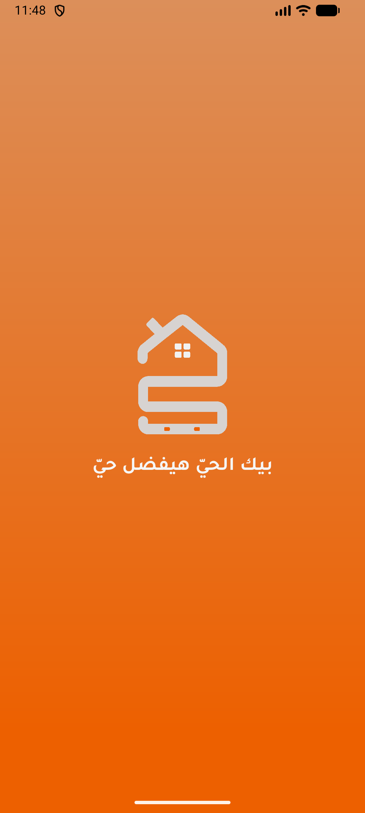
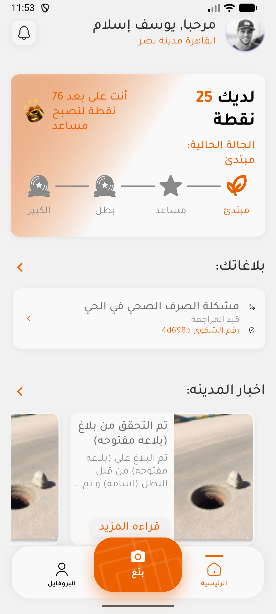
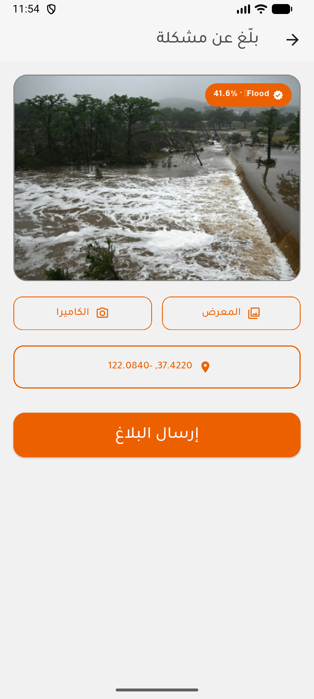
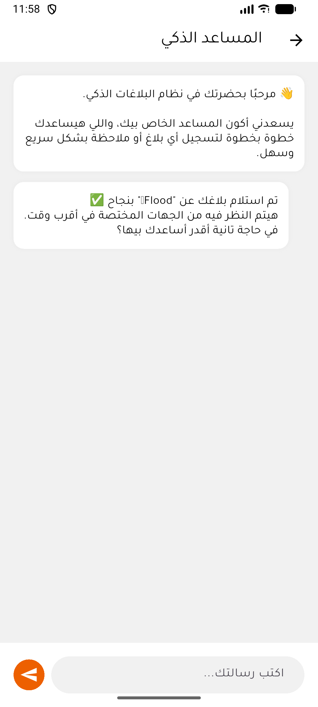
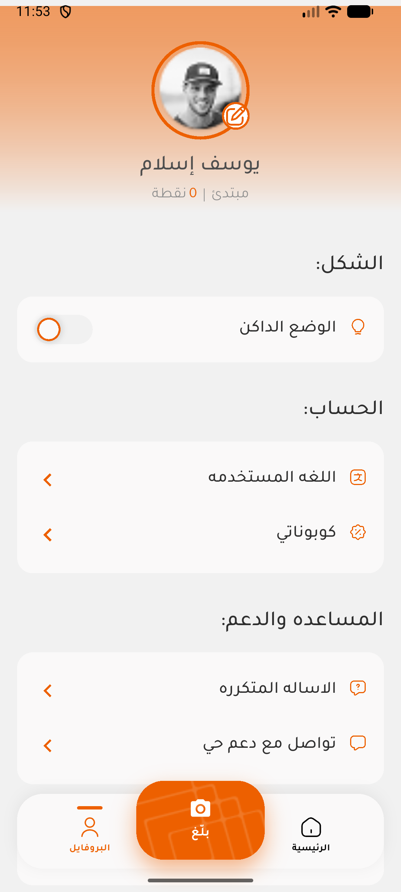
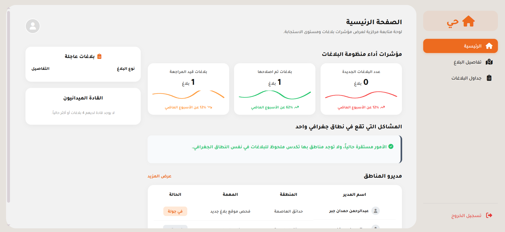
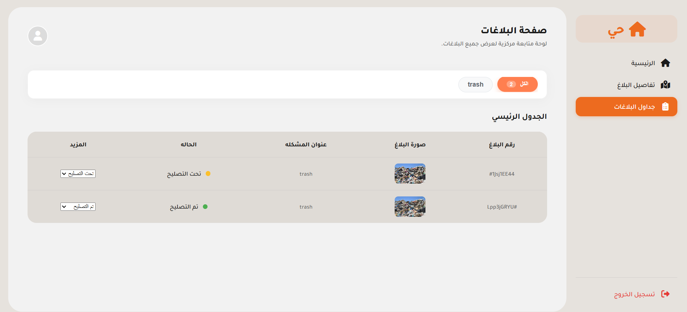

<div align="center">

# هاي — HAI 🏙️

### تطبيق هاي — Smart City Reporting App

تطبيق ذكي لتسهيل التواصل بين المواطنين والجهات المسؤولة عن البنية التحتية في المدن المصرية

A smart mobile app that bridges communication between citizens and municipal authorities for infrastructure issue reporting in Egyptian cities.

**Graduation Project** — Built with Flutter, Firebase & On-Device AI

[](https://flutter.dev)
[](https://firebase.google.com)
[](https://dart.dev)
[](LICENSE)

</div>

---

## 📱 About / نبذة عن التطبيق

**HAI (هاي)** is a smart city reporting application that empowers citizens to report infrastructure issues — such as road damage, flooding, trash accumulation, and more — using AI-powered image classification and optional face verification for secure identity confirmation.

تطبيق **هاي** يمكّن المواطنين من الإبلاغ عن مشاكل البنية التحتية في مدنهم (طرق، فيضانات، نفايات...) باستخدام الذكاء الاصطناعي لتصنيف الصور تلقائياً والتحقق من الهوية.

### 🌐 Live Dashboard / لوحة التحكم

The admin dashboard is deployed and accessible at:

🔗 **[hai-app-eg.web.app](https://hai-app-eg.web.app/)**

> **Demo credentials / بيانات الدخول التجريبية:**
> - Email: `admin@example.com`
> - Password: `admin123`

---

## 📸 Screenshots / لقطات الشاشة

### Mobile App / التطبيق

<div align="center">
<table>
  <tr>
    <td align="center"><b>Splash Screen</b><br>شاشة البداية</td>
    <td align="center"><b>Home</b><br>الرئيسية</td>
    <td align="center"><b>AI Report</b><br>بلاغ ذكي</td>
    <td align="center"><b>AI Chat</b><br>المساعد الذكي</td>
    <td align="center"><b>Profile</b><br>البروفايل</td>
  </tr>
  <tr>
    <td></td>
    <td></td>
    <td></td>
    <td></td>
    <td></td>
  </tr>
</table>
</div>

### Admin Dashboard / لوحة التحكم

<div align="center">
<table>
  <tr>
    <td align="center"><b>Dashboard Home</b> — مؤشرات الأداء</td>
    <td align="center"><b>Reports Table</b> — جدول البلاغات</td>
  </tr>
  <tr>
    <td></td>
    <td></td>
  </tr>
</table>
</div>

---

## ✨ Features / المميزات

| Feature | Description |
|---------|-------------|
| 📸 **AI Report Classification** | On-device TFLite model classifies report images into categories: road damage, flooding, trash, or other — تصنيف تلقائي للبلاغات بالذكاء الاصطناعي |
| 🤖 **AI Chat Assistant** | Groq-powered chatbot for citizen guidance — مساعد ذكي يعمل بالذكاء الاصطناعي |
| 👤 **Face Verification** | MobileFaceNet on-device face matching for identity verification — تحقق من الهوية بالتعرف على الوجه |
| 📝 **Report Management** | Citizens create, track, and manage infrastructure reports — إنشاء ومتابعة البلاغات |
| 🏆 **Gamification / Leaderboard** | Points system (25 pts per report) with leaderboard — نظام نقاط ولوحة متصدرين |
| 🎟️ **Coupons / Rewards** | Redeem accumulated points for coupons — استبدال النقاط بكوبونات |
| 🔔 **Notifications** | Real-time notification system — إشعارات فورية |
| 🌍 **Geolocation** | Location tagging for reports — تحديد موقع البلاغ |
| 🛡️ **Admin Dashboard** | Web-based React dashboard for managing reports and employees — لوحة تحكم للمسؤولين |
| 🔐 **Firebase Auth** | Secure authentication with Firebase — تسجيل دخول آمن |

---

## 🏗️ Tech Stack / التقنيات المستخدمة

### Mobile App (Flutter)
| Technology | Purpose |
|-----------|---------|
| **Flutter 3.9+** / **Dart 3.9+** | Cross-platform mobile framework |
| **BLoC / Cubit** | State management |
| **get_it** | Dependency injection |
| **Firebase Auth** | Authentication |
| **Cloud Firestore** | NoSQL database |
| **Firebase Storage** | Image storage |
| **TFLite Flutter** | On-device AI inference |
| **Google ML Kit** | Face detection |
| **Groq API** | AI chat assistant |
| **Cloudinary** | Image upload CDN |
| **Hive** | Local caching |

### Admin Dashboard
| Technology | Purpose |
|-----------|---------|
| **React** (Vite) | Web dashboard framework |
| **Firebase Auth** | Admin authentication |
| **Cloud Firestore** | Real-time data |
| **Firebase Hosting** | Deployment at [hai-app-eg.web.app](https://hai-app-eg.web.app/) |

---

## 📁 Project Structure / هيكل المشروع

```
hai_app/
├── lib/
│   ├── main.dart                    # App entry point
│   ├── app_router.dart              # Named route definitions
│   ├── firebase_options.dart        # Firebase config (auto-generated)
│   ├── core/
│   │   ├── di/                      # Dependency injection (get_it)
│   │   ├── data/                    # Shared data utilities
│   │   ├── extensions/              # Dart extension methods
│   │   ├── helpers/                 # Route names, constants
│   │   ├── network/                 # API clients (Dio)
│   │   ├── services/                # Classification service, etc.
│   │   ├── storage/                 # Local storage helpers
│   │   └── styling/                 # App colors, text styles
│   ├── features/
│   │   ├── auth/                    # Login, signup, ID card, face verification
│   │   ├── chat/                    # AI chatbot (Groq)
│   │   ├── coupons/                 # Rewards & coupon redemption
│   │   ├── home/                    # Main home screen & navigation
│   │   ├── leaderboard/            # Points ranking
│   │   ├── notification/           # Push notifications
│   │   ├── post/                    # Community posts feed
│   │   ├── profile/                 # User profile management
│   │   ├── report/                  # Report creation & tracking
│   │   ├── splash/                  # Splash screen
│   │   ├── welcomeboard/           # Onboarding
│   │   └── worker/                  # Municipal worker features
│   └── l10n/                        # Localization (Arabic)
├── assets/
│   ├── icons/                       # SVG icons
│   ├── images/                      # App images & icon
│   ├── fonts/                       # Tajawal font family
│   ├── LightModel.tflite            # Image classification model (custom)
│   ├── mobilefacenet.tflite         # Face recognition model (open source)
│   └── labels.txt                   # Classification labels (flood, road, trash, other)
├── hai-dashboard/                   # React admin dashboard (Vite)
│   └── src/
├── hai-backend/                     # ⚠️ Legacy Node.js backend (see its README)
├── planning/                        # Project planning documents
├── firestore.rules                  # Firestore security rules
├── storage.rules                    # Firebase Storage rules
├── firebase.json                    # Firebase project config
└── test/                            # Unit & widget tests
```

### Architecture / البنية المعمارية

Each feature follows **Clean Architecture** with strict layer separation:

```
feature/
├── data/            # Repositories, data sources, models
│   ├── repo/        # Repository implementations
│   └── model/       # Data models & DTOs
├── domain/          # Business logic contracts (no Flutter imports)
│   ├── entity/      # Domain entities
│   └── repo/        # Repository contracts (abstract classes)
└── presentation/    # UI layer (zero business logic)
    ├── cubit/       # State management (Cubit + sealed states)
    ├── screens/     # Screen widgets
    └── widgets/     # Reusable UI components
```

---

## 🚀 Getting Started / البدء

### Prerequisites / المتطلبات

- [Flutter SDK](https://docs.flutter.dev/get-started/install) 3.9+
- [Firebase CLI](https://firebase.google.com/docs/cli) (for deployment)
- Android Studio / VS Code
- A physical device or emulator (camera features need a real device)

### Setup / التثبيت

1. **Clone the repository**
   ```bash
   git clone https://github.com/blackjoker94/hai_app.git
   cd hai_app
   ```

2. **Create your environment file**
   ```bash
   cp .env.example .env
   ```
   Then fill in your API keys in `.env`:
   - `GROQ_API_KEY` — from [Groq Console](https://console.groq.com/keys)
   - `CLOUDINARY_CLOUD_NAME` & `CLOUDINARY_UPLOAD_PRESET` — from [Cloudinary](https://cloudinary.com/console)

3. **Install dependencies**
   ```bash
   flutter pub get
   ```

4. **Run the app**
   ```bash
   flutter run
   ```

> **Note:** The app uses the existing Firebase project (`hai-app-eg`). If you want to use your own Firebase project, run `flutterfire configure` and update `firebase_options.dart`.

---

## 🤖 AI Models / نماذج الذكاء الاصطناعي

| Model | File | Purpose | Source |
|-------|------|---------|--------|
| **LightModel** | `assets/LightModel.tflite` | Image classification (flood, road, trash, other) | Custom — built by [@OmarSafwan](https://github.com/OmarSafwan) |
| **MobileFaceNet** | `assets/mobilefacenet.tflite` | Face embedding extraction for identity verification | Open-source pre-trained model |

The classification model runs **entirely on-device** using TFLite Flutter — no internet required for image analysis.

---

## 👥 Contributors / المساهمون

| Name | Role | GitHub |
|------|------|--------|
| **Youssef eslam** | Flutter Mobile App Developer | [@blackjoker94](https://github.com/blackjoker94) |
| **Omar Safwan** | AI / Machine Learning Engineer | [@OmarSafwan](https://github.com/OmarSafwan) |
| **Moustafa Foaad** | Backend & Dashboard Developer | — |
| **Abdelrahman Hemdan** | UI/UX Designer | — |

---

## 📄 License / الترخيص

This project is part of a graduation project. Feel free to use it as reference for learning purposes.

---

<div align="center">

**Built with ❤️ in Egypt 🇪🇬**

هاي — لمدينة أذكى

</div>
